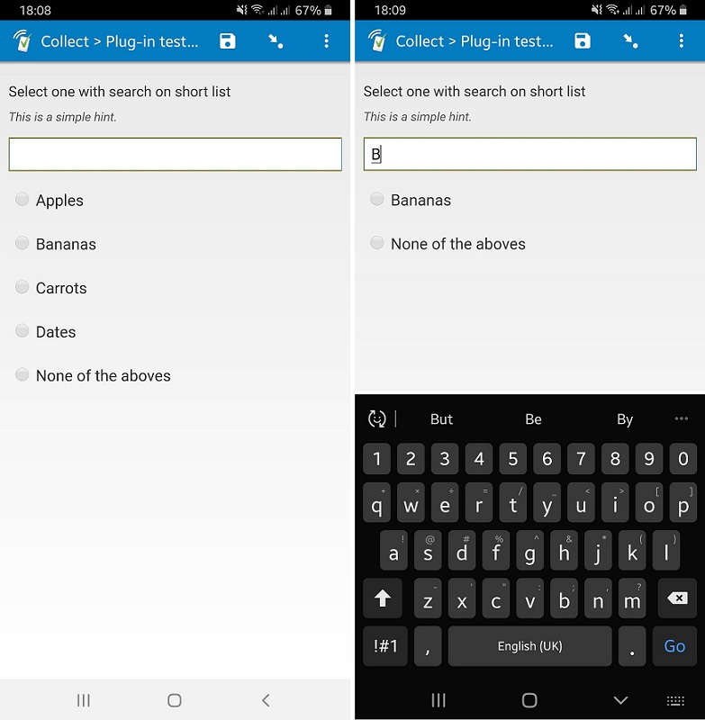
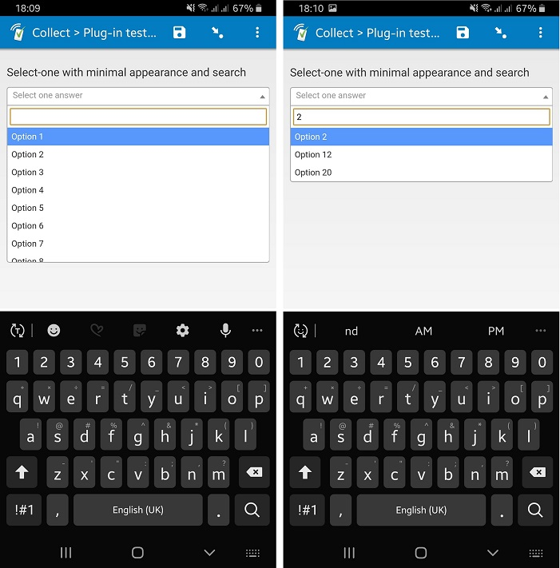

# Search select one

*Screenshot of search using default appearance*

*Screenshot of search using minimal appearance*

## Description

*Requires at least Android 6 to work on SurveyCTO Collect*.

This field plug-in adds the ability to filter choice list options for a *select_one* field. Filter by entering search text into the search field. Also see the sibling field plug-in, [search-select_multiple](https://github.com/surveycto/search-select-multiple).

### Data Format
This field plug-in supports the `select_one` and `select_multiple` field types.
Values are stored normally as per the above field types.

## How to use

### Getting Started
1. Download the sample form [extras/sample-form](https://github.com/surveycto/search-select-one/raw/master/extras/sample-form/Sample%20Form%20-%20Search%20a%20select_one%20choice%20list.xlsx) from this repo and upload it to your SurveyCTO server.
1. Download the [search-select-one.fieldplugin.zip](https://github.com/surveycto/search-select-one/raw/master/search-select-one.fieldplugin.zip) file from this repo, and attach it to the sample form on your SurveyCTO server.

### Default SurveyCTO feature support

| Feature / Property | Support |
| --- | --- |
| Supported field type(s) | `select_one`|
| Default values | Yes |
| Custom constraint message | Yes |
| Custom required message | Yes |
| Read only | No |
| media:image | Yes |
| media:audio | Yes |
| media:video | Yes |
| `quick` appearance | Yes |
| `minimal` appearance | Yes |

## More resources

* **Sample form**  
You can find a sample form definition here:   
[Download sample form](https://github.com/surveycto/search-select-one/tree/master/extras/sample-form)  

* **Developer documentation**  
Instructions and resources for developing your own field plug-ins.  
[https://github.com/surveycto/Field-plug-in-resources](https://github.com/surveycto/Field-plug-in-resources)

* **User documentation**  
How to get started using field plug-ins in your SurveyCTO form.  
[https://docs.surveycto.com/02-designing-forms/03-advanced-topics/06.using-field-plug-ins.html](https://docs.surveycto.com/02-designing-forms/03-advanced-topics/06.using-field-plug-ins.html)
